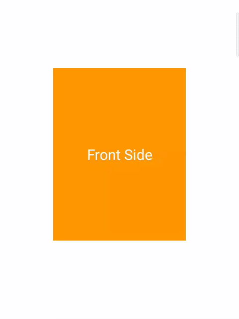
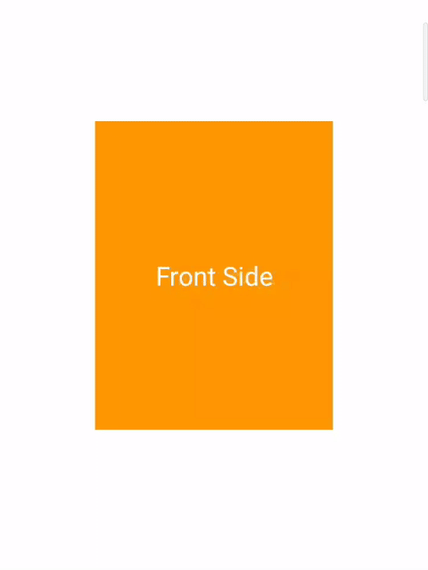
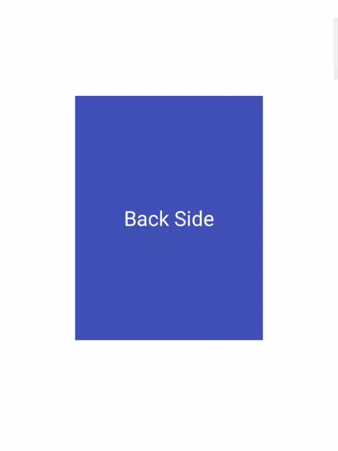
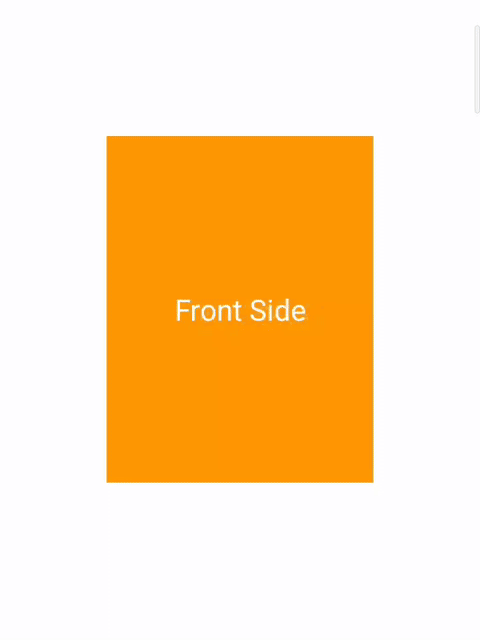

# FlipCardView – Android Card Flip Library (Horizontal/Vertical + Unlimited Cards)
[](https://kotlinlang.org/)
[](LICENSE)
[](#)

---
**FlipCardView** is a highly customizable Android UI library that provides **beautiful 3D flip animations**, supporting:

- Front ↔ Back flip  
- Unlimited cards (deck flipping)  
- Horizontal / Vertical flips  
- Flip from left/right or top/bottom  
- Smooth animation with shadow  
- Dynamic API-driven cards  
- XML configuration

Works like a real-world card deck — perfect for quizzes, flashcards, onboarding screens, and playful UI transitions.

---

## Demo

<p align="center">
  
  
  
  
</p>


---

## ✨ Features

✔ Flip horizontally (Left → Right / Right → Left)  
✔ Flip vertically (Top → Bottom / Bottom → Top)  
✔ Add unlimited cards  
✔ Deck navigation: `nextCard()`, `prevCard()`  
✔ Smooth 3D animation  
✔ Lift shadow while flipping  
✔ XML attributes for full control  
✔ Supports dynamic card creation (API data)  
✔ Easy integration & lightweight  

---

## 📦 Installation (JitPack)

Add JitPack in your `settings.gradle`:

```gradle
dependencyResolutionManagement {
    repositories {
        google()
        mavenCentral()
        maven { url = uri("https://jitpack.io") }
    }
}
```

Add the library dependency:

```
implementation("com.github.Excelsior-Technologies-Community:flipcard:1.0.0")
```
---

## Usage

1️⃣ Add FlipCardView in XML
```xml
<com.ext.flipcard.FlipCardView
    android:id="@+id/flipCard"
    android:layout_width="250dp"
    android:layout_height="350dp"
    app:flipDirection="horizontal"
    app:flipHorizontalSide="left"
    app:flipDuration="500"
    app:flipShadow="true" />
```

2️⃣ Add Cards (Static Layout XMLs)
```kotlin
flipCard.addCardView(R.layout.card_front)
flipCard.addCardView(R.layout.card_back)
flipCard.addCardView(R.layout.card_third)
```

3️⃣ Add Cards from API (Dynamic Views)
```kotlin
apiList.forEach { item ->
    val v = layoutInflater.inflate(R.layout.card_item, null)
    v.findViewById<TextView>(R.id.title).text = item.title
    v.findViewById<ImageView>(R.id.image).load(item.imageUrl)

    flipCard.addCard(v)
}
```

🔄 Deck Navigation
```kotlin
flipCard.nextCard()     // Go to next
flipCard.prevCard()     // Go to previous

//Set this on clicklisteners
```

---

## XML Attributes

| Attribute            | Type     | Default     | Values                      | Description                                |
|----------------------|----------|-------------|-----------------------------|--------------------------------------------|
| `flipDirection`      | enum     | `horizontal` | `horizontal`, `vertical`     | Sets the main flip axis                    |
| `flipDuration`       | integer  | `400` ms     | Any integer (milliseconds)  | Flip animation duration                    |
| `flipShadow`         | boolean  | `true`       | `true`, `false`             | Enables 3D shadow during flip              |
| `flipHorizontalSide` | enum     | `left`       | `left`, `right`             | Sets horizontal flip origin direction      |
| `flipVerticalSide`   | enum     | `top`        | `top`, `bottom`             | Sets vertical flip origin direction        |

---

## Example Usage

Example Usage in XML

```xml
<?xml version="1.0" encoding="utf-8"?>
<LinearLayout xmlns:android="http://schemas.android.com/apk/res/android"
    xmlns:app="http://schemas.android.com/apk/res-auto"
    xmlns:tools="http://schemas.android.com/tools"
    android:id="@+id/main"
    android:gravity="center"
    android:background="@color/white"
    android:orientation="vertical"
    android:layout_width="match_parent"
    android:layout_height="match_parent"
    tools:context=".MainActivity">

    <com.ext.flipcard.FlipCardView
        android:id="@+id/flipCard"
        android:layout_width="200dp"
        android:layout_height="260dp"
        app:flipDirection="vertical"
        app:flipVerticalSide="bottom"
        app:flipDuration="700"
        app:flipShadow="true" />
    
</LinearLayout>
```

Example Usage in Kotlin

```kotlin
import android.os.Bundle
import androidx.activity.enableEdgeToEdge
import androidx.appcompat.app.AppCompatActivity
import androidx.core.view.ViewCompat
import androidx.core.view.WindowInsetsCompat
import com.ext.flipcard.FlipCardView

class MainActivity : AppCompatActivity() {
    override fun onCreate(savedInstanceState: Bundle?) {
        super.onCreate(savedInstanceState)
        enableEdgeToEdge()
        setContentView(R.layout.activity_main)
        ViewCompat.setOnApplyWindowInsetsListener(findViewById(R.id.main)) { v, insets ->
            val systemBars = insets.getInsets(WindowInsetsCompat.Type.systemBars())
            v.setPadding(systemBars.left, systemBars.top, systemBars.right, systemBars.bottom)
            insets
        }
        val card = findViewById<FlipCardView>(R.id.flipCard)

        val view1 = layoutInflater.inflate(R.layout.front_card, null)
        val view2 = layoutInflater.inflate(R.layout.back_card, null)
        val view3 = layoutInflater.inflate(R.layout.third_card, null)

        card.addCard(view1)
        card.addCard(view2)
        card.addCard(view3)


        card.setOnClickListener {
            card.nextCard()
        }
    }
}
```

---

## License

```
MIT License

Copyright (c) 2025 Excelsior Technologies 

Permission is hereby granted, free of charge, to any person obtaining a copy
of this software and associated documentation files (the "Software"), to deal
in the Software without restriction, including without limitation the rights
to use, copy, modify, merge, publish, distribute, sublicense, and/or sell
copies of the Software, and to permit persons to whom the Software is
furnished to do so, subject to the following conditions:

The above copyright notice and this permission notice shall be included in all
copies or substantial portions of the Software.

THE SOFTWARE IS PROVIDED "AS IS", WITHOUT WARRANTY OF ANY KIND, EXPRESS OR
IMPLIED, INCLUDING BUT NOT LIMITED TO THE WARRANTIES OF MERCHANTABILITY,
FITNESS FOR A PARTICULAR PURPOSE AND NONINFRINGEMENT. IN NO EVENT SHALL THE
AUTHORS OR COPYRIGHT HOLDERS BE LIABLE FOR ANY CLAIM, DAMAGES OR OTHER
LIABILITY, WHETHER IN AN ACTION OF CONTRACT, TORT OR OTHERWISE, ARISING FROM,
OUT OF OR IN CONNECTION WITH THE SOFTWARE OR THE USE OR OTHER DEALINGS IN THE
SOFTWARE.
```


